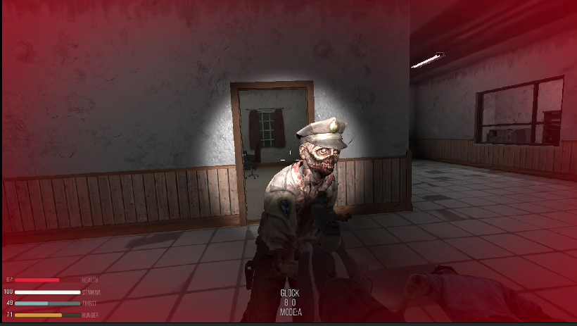

# Welcome to Zombie Asylum
### by Don Falk

---

---

## Recommended System Requirements

- *Linux Mint 22.3 x86_64*
- *AMD Ryzen 7 5800H*
- *NVIDIA GeForce RTX 3060*

---

## Common Keyboard Shortcuts

| Key | Action |
|-----|--------|
| `W` `A` `S` `D` | **Walk** — Forward, Left, Backwards, Right |
| `W` `A` `S` `D` + `Shift` | **Run** |
| `Spacebar` | **Jump** |
| `Ctrl` | **Crouch** |
| `E` | **Lean Right** |
| `Q` | **Lean Left** |
| `R` | **Reload** your weapon |
| `F` | **Use** Object |
| `Tab` | **Inventory** *(Note: Bottom slots assign weapons)* |
| `1` – `3` | Switch between **weapons** you have assigned |

---

## Mouse

| Input | Action |
|-------|--------|
| Movement | Change **View** |
| Left Click | **Fire** Weapon |
| Right Click & Hold | **Aim** Weapon |

---

## Asylum Rooms

**First Floor**
- Day Room
- Gatehouse
- Guard Room
- Stock
- Office
- Kitchen
- Kitchen Stock
- Dining Room
- Men's Toilet
- Woman's Toilet
- Visit Room

**Second Floor**
- Classroom
- Bathroom
- Bedroom
- Exam Room
- Kitchen
- Office
- Surgery
- Men's Toilet
- Woman's Toilet

**Basement**
- Machine Room
- Morgue
- Seclusion Room A
- Seclusion Room B

---

## Changelog

### [2026-03-25]

Initial Publication on GitHub.

**Project Status**

Considering others might enjoy this simple Unity based Zombie game, I thought I'd post it here.

**Unity Specs**

> Version 6000.3.11f1
> Universal Render Pipeline

### [2025-02-05]

Additional gameplay features have been added.

**Project Status**

Switched over to Unity's Universal Render Pipeline. There are still thirty-two Zombies, but now five Weapons in the scene. To set the mode, lights are dimmed. However, for the novice user, it's possible to turn them back on by interacting with the switch on the Machine Room wall in the Basement. Want a Challenge? Start out by entering the Gatehouse and pressing the Emergency button. In any case, beware, they may seem docile at first, but things could turn ugly.

**Unity Specs**

> Version 2022.3.17f1
> Universal Render Pipeline

---

### [2024-03-26]

Beta testing is progressing well. Now down to some fine tuning.

**Project Status**

At this stage of the Beta test, there are thirty-two Zombies, four Weapons, and additional Ammo available in the scene. There is sufficient fire power to eliminate all the zombies. Speed is still of the essence, but more consumables have been added to the scene to recharge you while you learn the layout of the game. Challenges await. Enjoy!

**Unity Specs**

> Version 2022.3.17f1
> Built-In Render Pipeline

---

### [2024-02-23]

Continuing to work on wall and door clipping. Building a Windows version for those interested in Beta testing.

**Project Status**

In the Beta test stage, there are now twenty-three Zombies and four Weapons in the scene. There is enough ammunition to complete the task at hand. But, Speed is of the essence, before consumables run out to recharge you.

**Unity Specs**

> Version 2022.3.17f1
> Built-In Render Pipeline

---

### [2024-02-18]

Basic logic complete. I've worked further on the C# scripting inherited from the DarkTree FPS.

My main source of zombies were purchased on CGTrader. The onboarding process of importing them into the project has been fine tuned. The consistency vastly speeds up things and makes for balanced logic and game play.

**Project Status**

In the Alpha stage, there are now seventeen Zombies in the scene. There are four weapons to take them out, as well as some sample consumables (Medical, Drink, Eat). Enjoy learning from and countering the game play.

**Unity Specs**

> Version 2022.3.17f1
> Built-In Render Pipeline

---

### [2024-02-01]

Initial "Proof of Concept" complete. Mainly been working out the C# scripting kinks and familiarizing with what was inherited from the DarkTree FPS.

Coming from a systems programming background, this project relies on commercial assets from animators, artists, and sound technicians. As some of these are "paid for" assets, sharing the complete Unity project code on GitHub is not possible, so this route was chosen instead.

The purpose here is to document the progress and share the results.

**Project Status**

As a Proof of Concept, there are only two Zombies in the scene. There is a Shotgun to take them out, as well as some sample consumables (Medical, Drink, Eat). Enjoy discovering the layout and finding them.

**Unity Specs**

> Version 2022.3.17f1
> Built-In Render Pipeline

---

## Credits & Licensing

| Asset | Artist / Author | License |
|-------|----------------|---------|
| DarkTree FPS v1.4 | HabTeam | Standard Unity Asset Store EULA |
| Abandoned Asylum | Lukas Bobor | Standard Unity Asset Store EULA |
| Fridge Old and New | mgsvevo | Standard Unity Asset Store EULA |
| Zombie Monster Animation FREE | Kevin Iglesias | Standard Unity Asset Store EULA |
| Basic Motions FREE | Kevin Iglesias | Standard Unity Asset Store EULA |
| Zombie Man AA | New Punch | Standard Unity Asset Store EULA |
| Zombie Female Scrub | CGTrader — fxschoolstore | Royalty Free License |
| Zombie Police Male 3 | CGTrader — fxschoolstore | Royalty Free License |
| Zombie Civilian Construction | CGTrader — fxschoolstore | Royalty Free License |
| Zombie Fast Food | CGTrader — fxschoolstore | Royalty Free License |
| Zombie Civilian Male Suit | CGTrader — fxschoolstore | Royalty Free License |
| Zombie Civilian Female 06 | CGTrader — fxschoolstore | Royalty Free License |
| Dirty Urinal Low-poly 3D model | CGTrader — aqilmyrson | Royalty Free License |
| Survival Game Tools | cookiepopworks.com | Standard Unity Asset Store EULA |
| Blood splatter decal package | NorSat Entertainment | Standard Unity Asset Store EULA |
| Fesliyan Studios Sound Effects | Fesliyan Studios | Royalty Free Music |
| Abandoned Building Ambience | YouTube | YouTube Terms of Service |
| Quick Sounds | quicksounds.com | Free Sound Effects Library |
| QA Books | QAtmo | Standard Unity Asset Store EULA |
| Cardboard Boxes with Tape | GVOZDY | Standard Unity Asset Store EULA |
| Fire Extinguisher | KrazyFX | Standard Unity Asset Store EULA |
| Medical Saw | ESsplashkid | Standard Unity Asset Store EULA |
| Rigged Stethoscope | Simon Serge Pasi | Standard Unity Asset Store EULA |
| PBR Cardboard Box | Crow Art | Standard Unity Asset Store EULA |
| Wrench | KrazyFX | Standard Unity Asset Store EULA |
| Rusted lever switch | CGTrader — SergioDelacruz | Royalty Free License |
| Industrial Control Buttons | SIUP | Standard Unity Asset Store EULA |
| Industrial Lighting Package | leonidas10009 | Standard Unity Asset Store EULA |
| Old Pans | Pixelcloud | Standard Unity Asset Store EULA |
| Plates, Bowls & Mugs Pack | Robot Skeleton | Standard Unity Asset Store EULA |
| Realistic toaster | SnowQ | Standard Unity Asset Store EULA |
| Surveillance Camera | AK STUDIO ART | Standard Unity Asset Store EULA |
| Round Shaped Wall Clock Free low-poly 3D model | CGTrader — wireman | Royalty Free No AI License |
| Desk Clock VR Ready Free low-poly 3D model | CGTrader — SimCoVR-srl | Royalty Free No AI License |
| Old Classical Chair | SimViz | Standard Unity Asset Store EULA |
| Armchair 023 | TurboSquid — 3DMarko | Standard License |
| Swivel Chair Vintage Brown Free low-poly 3D model | CGTrader — contslayer | Royalty Free No AI License |
| CC0 - Tray Free low-poly 3D model | CGTrader — plaggy | Royalty Free No AI License |
| Scalpel, Rampley, Retractor, Toothed Forceps Free low-poly 3D model | CGTrader — Lkko | Royalty Free No AI License |
| Medicine Pills Asset Pack customisable Free 3D model | CGTrader — axhadnagy | Royalty Free No AI License |
| Old Wooden Cabinet | Tatiana Gladkaya | Standard Unity Asset Store EULA |
| Chest of Drawers | Ciconia Studio | Standard Unity Asset Store EULA |
| Ornate Picture Frame | CGTrader — 3d-dojo | Royalty Free No AI License |
| PBR Textures (pack) for floor | Maksim Bugrimov | Standard Unity Asset Store EULA |
| Plague Doctor Medicine Bottle Free low-poly 3D model | CGTrader — paletteconcepts | Royalty Free No AI License |
| Garage Tool Collection Free 3D model | CGTrader — Guy-In-a-Poncho | Royalty Free No AI License |
| Ball Peen Hammer PBR Free 3D model | CGTrader — artssionate | Royalty Free No AI License |
| Used Cable Cutter PBR Free low-poly 3D model | CGTrader — pro-cyon | Royalty Free No AI License |
| AC Units - Game Ready Free low-poly 3D model | CGTrader — abistar | Royalty Free No AI License |
